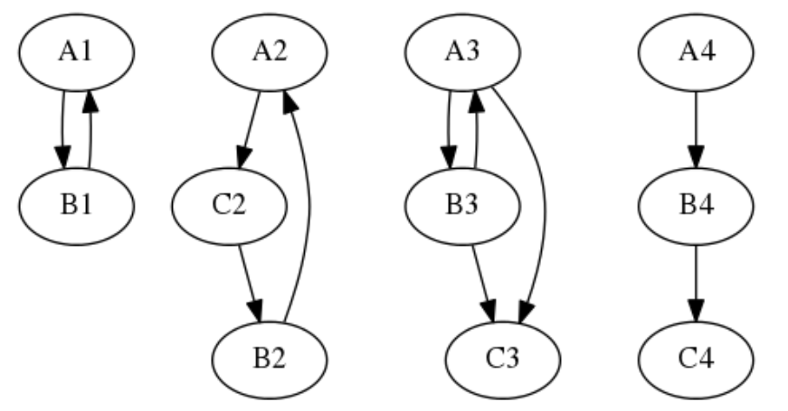

# Pagerank school project

The project constructs four predefined graphs and iteratively calculates the pagerank for each page of each graph.

Here are the example graphs: 

The console printed values associate as follows: "page_id: pagerank"

Where page_id is constructed starting at a1 = 0 and ends with c4 = 10

## How to run

Make sure rust is installed on your system, an installation guide can be found [here](https://www.rust-lang.org/tools/install).

> cargo build

Then run the resulting binary, typically found inside target/debug.

## How to test

Run tests using cargo:

> cargo test

Test modules are found inside the module under test, as described in rusts [Handbook](https://doc.rust-lang.org/book/ch11-01-writing-tests.html).

## CI/CD

Continous integration has been added, the results can be seen here:

